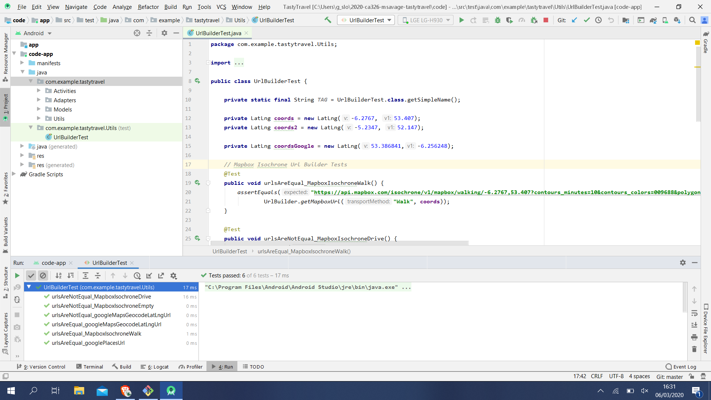
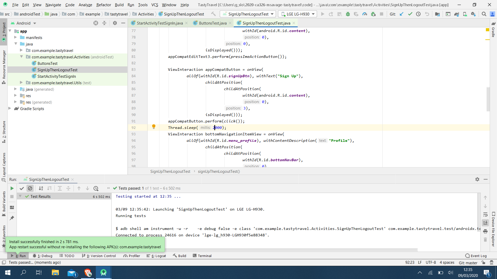
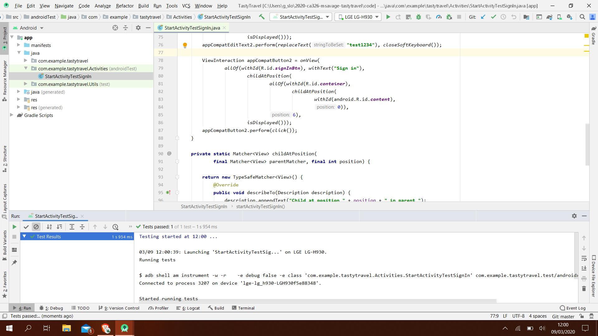
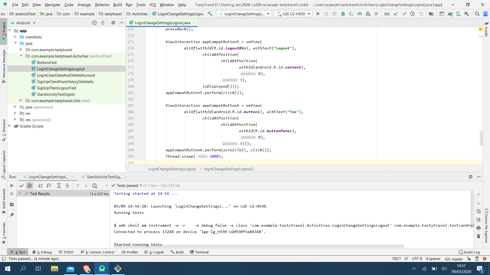
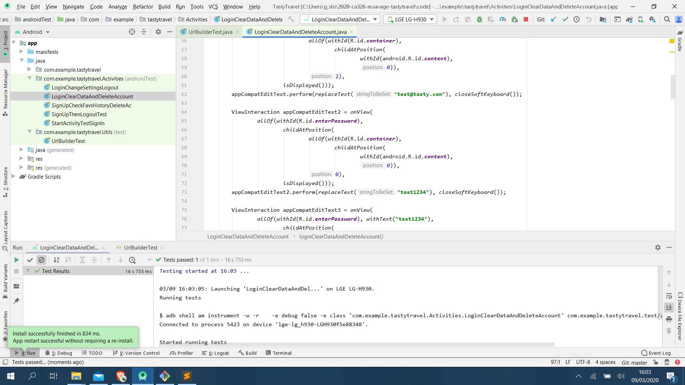

# Unit and Integration Testing
Using JUnit 4 we designed tests cases to test basic Java code that was then executed in the JVM on our laptops. We tested the UrlBuilder class using assertEqual and assertNotEqual to compare expected behaviour and actual function results.

All functions of the URL builder class were tested providing different scenarios to the MapboxUrlBuilder and the GooglePlacesUrlBuilder. All test cases successfully passed as seen in this image.

---
When we had the raw Java code tested we moved onto using Espresso to test the applications interface. We tested button selection and application behaviour for both a user that was logged in and not logged in.

We started  by ensuring a new user could sign up and logout easily. We tested the user signup option on the start screen and provided the neccessary signup details. After logging in we tested the logout option. Both operations passed our tests.

Next, we tested if a returning user was simply able to access their account again by logging in.
Although this was a basic test, if was quite important to the apps functionality.

Next, we expanded on the sign in test by getting the logged in user to navigate to the profile tab and change the map customisation settings. Both the Isochrone Builder and Midpoint Locality were turned on, then off. This allowed us to see if the application was saving the toggle switch state even when the application was closed and reopened.

Next we tested if a logged in user could access their saved places and history. This involved navigating the saved places map and history page list view.

Next we tested if a user could login and clear any saved data they had on their account such as saved places and their search history.

