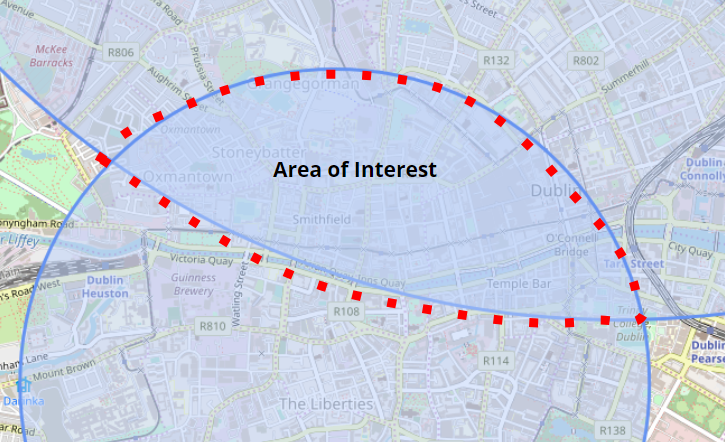

**Section 1: Introduction**  
1.1 Overview  
1.2 Business Context  
1.3 Glossary  

**Section 2: General Description**  
2.1 Product System Functions  
2.2 User Characteristics and Objectives  
2.3 Operational Scenarios  
2.4 Implementation Constraints  

**Section 3: Functional Requirements**  
3.1 Sign Up  
3.2 Create Profile  
3.3 Login  
3.4 Edit Profile  
3.5 Meeting Point Search  
3.6 Calculate Meeting Point  
3.7 Delete Profile

**Section 4: System Architecture**  
4.1 System Architecture Diagram 

**Section 5: High-Level Design**  
5.1 Context Diagram  
5.2 Use Case Diagram  
5.3 Higher Level Design Diagram and Description  

**Section 6: Preliminary Schedule**  
6.1 Task Table  
6.2 Gantt Chart  

**Section 7: Appendix**  

------
------

# Section 1: Introduction

##### 1.1 Overview
The product being developed fits in the category of Travel & Dining. The main functionality of our app is to help a user and a person they want to meet find a meeting location by journey time rather than physical travel distance. The locations will be customised around personal preference. The app will be designed for Android devices using Android Studio IDE.

The system compares meeting points that are located equidistant from each party based on travel time and not ‘as the crow flies’. We plan to incorporate a margin of error of (travel time * 10%) for possible destination locations. For example, for a travel time of twenty minutes, locations X,Y,Z located in the range between 18 and 22 minutes away will still be considered no matter what mode of transport is selected.

Modes of transport available to the user in the app will include walking, cycling, driving and public transport. We plan to recommend a top three selection of available meeting points for each search. The routes will be ranked according to personal preference of food/drink and travel time. If the three returned locations are not to the users liking, they can see more search results returned by clicking the option ‘show more’.

Suitable meeting points will be located within an overlap of two variables ‘radius’ (linked to a circle), depending on the distance possible to travel within a given time via the supplied mode of transport from the users starting point. In the backend of the app we will have an appropriate algorithm to compute this radius and overlap. When a meeting point is selected the user will be supplied with the option of starting the meeting process, or saving the route for later.

Transport details will be returned to the user when the start option is selected. Information returned will include:
* the required transport route and starting point for public transport.
* expected time of arrival based to meeting point based on mode of transport.

##### 1.2 Business Context
* _Demographic_: Our app will be suitable for a wide range of demographics, it will be suitable for people of all genders over the age of 13. Users with basic technical knowledge will be able to use the app due to its simple layout.

* _Geographic Segment_: For this project we will be limiting our area of interest to Dublin only, this will help us fulfill the full functionality of the app and leave it easier to test. Incorporating public transport options in the greater dublin area will provide the users of our app with multiple options of getting around the city.

* _Unique Selling Point_: Our application returns a meeting point to the user based on travel time and not physical travel distance. This prevents unnecessary waiting for either party to arrive and the destination, thus helping prevent any compromise on either parties behalf.

* _Business Opportunity_: Some similar but disadvantaged solutions are currently available. These systems provide the user with a meeting point based on physical travel distance. It is likely that users will prefer our apps system of ranking based on travel time rather that physical travel distance.

* _Advertisements_: There will be no monetary advertisements. The app will be shared with peers to use as they like.

##### 1.3 Glossary  

| **Acronym**        | Defintion         |
| ------------- |:-------------:|
| **API**      | “Application Programming Interface” - an interface between different parts of the programme intended to simplify the implementation of software. |
| **SQL**    | “Structured Query Language”- a language used for relational database management and data manipulation. |
| **MapBox**    | A location data platform for mobile applications that provides the building blocks to add location features into an apps experience. |
| **TFI**     | “Transport For Ireland” - Journey Planner and Real Time Transport Information for the island of Ireland.    |
| **GUI**     | “Graphical User Interface” - Allows users to interact with electronic devices through an interface. |

----
----

# Section 2: General Description

##### 2.1 Product System Functions
Below is a preliminary list of the main functions for our android application. The list is open to future additions if necessary.

- User Sign Up
- Create User Profile*
- User Login*
- Location and Mode of Transport Input
- Meeting Point Search
- Generate Meeting Point
- Save Meeting Point*
- View Recent Meeting Points*
- Delete User Profile*
- User Log Out*

_*Requires User Login_

##### 2.2 User Characteristics and Objectives
The application will be accessible to anybody with access to an Android device and an Internet connection. The audience includes all genders over the age of 13. The age restriction is present due to Google’s requirement for all Google account holders to be above this age.

The app will be easily accessible with a user-friendly interface that the majority of users can successfully use. Ideally, the app would attract users who enjoy travelling to new places and experiencing new food & drink locations as well as socialising with peers. The app will have a public transport option so it is optimal that the user will have a good level of independence.

Some useful features that users will enjoy include :
- The ability to save some previous meeting points.
- If the user particularly enjoyed a meeting place from the past the app will allow them to save and revisit the location.

##### 2.3 Operational Scenarios
We will focus on three user levels for our operational scenarios.

_Unregistered Users:_  
* The unregistered user will have the application installed on their Android device, but will not yet have created a user account related to the app. This user has limited functionality of the application. Users without profiles can select the option, **‘Continue without user account’**, on the sign up screen to access the main features of the app. These features focus around the meeting point search aspect of the app where the user inputs user locations and selected modes of transport. Meeting locations are then returned to the user which they can choose from.

* The unregistered user will be restricted from accessing the following features:
    - Saving a favourite meeting place.
    - Seeing their meeting places recent history.
    - Having personalised search results according to user data.

* This limited functionality should encourage the unregistered user to create a user account to gain the full functionality of the application.

_Registering Users:_  
* A new user will be presented with the option to **‘sign up with email’** at the starting screen. Here the user can enter a valid email address and a password if they want to create an account. The user’s password will be stored securely using encryption. The user will not have to verify their email address to continue using the apps services. When the user account has been successfully created they will automatically logged into the new account and directed towards customising their account preferences including favourite food and drink.

_Registered Users:_  
* Users with profiles will remain logged into the app after registering and customising their profile. Re-entering the app will bypass the starting screen and the main screen will be displayed. Users with accounts will have the full functionality of the app including customised search results according to their profile data. These users can search for meeting points and save those places if they like. The registered user will also be able to view their previous location visit history.

##### 2.4 Implementation Constraints

_Time Constraints_
* The project will need to be completed for the deadline in March 2020. Project planning and time management will be a key concern for successful project completion. Unforeseen circumstances could cause delays. We plan to try and avoid any setbacks by setting realistic goals using a gantt chart and sticking to this rigid schedule.

_Group requirements_
* Being able to successfully work together to split up the work in both back-end and front-end my prove problematic. Problems arise when lack of knowledge of a service such as the TFI or Mapbox API may occur. We will therefore work closely together as a team and educate each other on the various services and programmes used throughout the app building process.

_Financial Constraints_
* In order for the app to present a live map, there must be a cost-effective service provider used. Mapping services that operate a billing system may become too expensive, so we will select the mapping service that best meets our needs on both a financial and functionality level.

_Application Efficiency_
* It is likely that our algorithm will grow in complexity and size. To avoid a large application install size we plan to implement a RESTful API which would allow our main algorithm to be accessed using API calls from the android application. A large application size would likely lead to sluggish performance on older android devices. Keeping the application small will allow our app to be installed on a broader range of devices.

----
----

# Section 3: Functional Requirements

##### 3.1 Sign Up
_Description_
* This would be the first step the user takes to create a user account linked with the app to access full service functionality. The user will be greeted with a main sign up page after launching the application on their device. If they press on the button labeled “Sign Up” they will be transferred to the signup page. To complete account sign up the user will be asked to enter their email address and enter a password. 

_Requisites_
* This function is critical for accessing the applications full functionality. Users who have signed up can save previous meeting points and view their meet point history leading to a more complete user experience.

_Technical Concerns_
* Handling the secure authentication of user details to ensure that only the account owner can access their account and no other. Securely storing sensitive user information ensuring user peace of mind is a number one priority.

Dependencies
* There are no dependencies.

##### 3.2 Create Profile
_Description_
* After successfully registering by entering their email and password, the profile customisation page will be displayed to the user. Here the user can enter their name, this is a required input. Other optional information includes prefered types of food and drink. None of the data entered will be publically viewable at any time, since no public profile exists within the service.

_Requisites_
* Profile information stored such as the users name allows personalised greetings throughout the application pages. Personal preferred food and drink allow for tailoring of returned search results. Profile information will allow for more precise and accurate search results being returned which matches the user needs better than general results.

_Technical Concerns_
* Once again secure management and storage of user information within the app interface and storage to a database is a priority.

_Dependencies_
* Adding profile information depends on the user sign up function first, profile information must be linked to a specific account. This function can only be accessed after successful account creation.

##### 3.3 Login
_Description_
* The ‘Login’ option is located on the same page as the ‘sign up’ option. If the user has accessed the service before they will have the opportunity to sign in to their account they had previously created. The user taps the ‘login’ option. When they have entered their email and password information they click the sign in button. If the information matches the system records they will be logged into their account.

_Requisites_
* This function is critical to allowing users full access to the system functions. Users will also have the option of installing the app on a new device or multiple devices and having the same data synced to each device they are signed in on, no account data will be exclusively stored locally.

_Technical Concerns_
* Providing the user with a secure interface where they can enter information in a secure manner. For example the users password will be obscured during the login and sign up process.

_Dependencies_
* Being able to login depends on the sign up and create profile functions.

##### 3.4 Edit Profile
_Description_
* After creating a profile on signup the user may wish to change or update some details supplied initially. The ‘Edit Profile’ is available to the user, it can be accessed through the user settings section of the app.

_Requisites_
* Not a critical feature but it is useful for users who have changed tastes or want to change their email or update their password.

_Technical Concerns_
* SQL Queries must be used in an efficient and secure manner to update stored user information.

_Dependencies_
* This function is dependent on the sign up and create profile functions.

##### 3.5 Search Location Interface
_Description_
* This function is available to all users of the app both registered and unregistered. It allows a user to enter their location and the second parties location. The user will also specify the mode of transport being used by each party for the trip. This search utility will be the main means of search used by the user to calculate a meeting point. Once the search function has executed it will return to the user a list consisting of the top three results applicable to the search.

_Requisites_
* This is a pivotal function of the application, without this the user would have no method of calculating a meeting point. This function also allows the user to view meeting points on a graphical mapping interface.

_Technical Concerns_
* Integrating the mapping service map into our application and being able to draw to the map, graphically displaying any meeting points and overlapping of locations.

_Dependencies_
* This function depends on the calculate meeting point function for returned search results. 

##### 3.6 Generate Route
_Description_
* This function works in conjunction with the meeting point search function to return possible suitable meeting points based on the input received from the search input boxes.

_Requisites_
* This function is the main focus of our app and without it the system would have little to no functionality except from storing user data. 

_Technical Concerns_
* We see this as the biggest technical challenge of the project and most of our time will be spent implementing this algorithm. Returned routes could cause a lot of problems like duplicated results, wrong results and not enough results. User input will have to be validated to ensure it is correct and can be used by the calculating algorithm.

_Dependencies_
* This function works hand in hand with the meeting point search function to allow the user to search for a meeting point. This function implements the search functionality algorithm while the meeting point search takes input.

##### 3.7 Delete Profile
_Description_
* Users who have created accounts must also be able to close such accounts. All data held on the user will be disposed of if the user chooses to delete their account. This includes all personal information like email address and saved places.

_Requisites_
* This is a critical function for any service, if the user not longer wants to use the application or wants their data removed from the systems server they should have the option to do that themselves without having to contact customer support.

_Technical Concerns_
* The SQL ‘DELETE’ command will be used by this function. A confirmation warning will be presented to the user before the action becomes permanent to prevent any unwanted data loss. The SQL database must be set up correctly to ensure that the proper user data is discarded of properly and not another users data.

_Dependencies_
* This function depends on the sign up, create profile and login functions.

----
----

# Section 4: System Architecture

##### 4.1 System Architecture Diagram

 
## Fig 1

Fig 1 above illustrates the architecture of the product. The diagram highlights the four main elements of our system architecture, mainly the mapping services api, the tastytravel app, the RESTful API consisting of the meeting point calculation algorithm and the SQL database where resources and data are stored.

1. **Mapping API**: We’ve decided to use Mapbox mapping service. The app installed on the android device will use API calls to the mapping service to display mapping information on screen as well as computing travel times. The mapping service is free to use and the mapping interface can be pre-configured to the programmers liking.

2. **Application installed on Android Device**: The app acts as the front end of the system, what the user interacts with to gain access to the other architectural elements and functionality of the system. This will be the least technical element of the product, its key use is to allow the user interact with the system in an aesthetically pleasing way. 

3. **RESTful Application API**: The meeting point algorithm will be accessed through a custom API. We will use HTTP requests such as POST, GET, PUT and DELETE. The RESTful API also allows the application to communicate with the SQL database. It will take information inputted through the GUI in input forms and send this information to be stored in the database through SQL commands.

4. **SQL Database**: The Database relates directly to the application RESTful API. It will store the user information sent to it using SQL commands. User data will be read and written to the database. This user information will serve to enrich the user experience of the application.

----
----

# Section 5: High-Level Design

##### 5.1 Context Diagram

 
## Fig 2

Fig 2 - The context diagram describes the relationship between the system and external entities through data. We can see that the TastyTravel app will receive the name, email address and password upon creating a user account or logging in to an existing account. 

When the user searches for a meeting point they supply the app with two locations and modes of transport. This data is used in conjunction with other information received from the mapping API, our own custom API and the TFI API to return search results to the user that includes a map and transport routes for viable meeting points. 

When the user edits or updates their user data account and possibly route data gets transferred to the database in the cloud server to be stored.

##### 5.2 Use Case Diagram

 
## Fig 3

Fig 3 - The use case diagram specifies the expected behaviour of and not the exact method of making it happen. In other words, it shows us the ‘what’ and hides the ‘how’.

Here we can see what **an “unregistered” or “registered” user** will want to do when they open the app. They have the option depending on their circumstances of signing in, creating an account, or skip the sign in page completely. We are not concerned with how they will create an account.

A use case diagram does not summarize relationship between actors and systems nor does it show the order in which steps are performed. It deals with the functional requirements.

##### 5.3 Higher Level Design Diagram

 

**Step 1: Sign Up**
Register an email address and choose a password to give the ability to login to the application.

**Step 2: Login**
Login to the application using the email and address supplied in step one above.

**Step 3: Create Profile**
Input your name and enter your personal preferences for favourite food and drink when prompted. 

**Step 4: Search Location**
Using the application GUI enter the user location information and their friends location data. Select the prefered mode of transport from the given list for each party also.

**Step 5: Generate Meeting Point**
Once the user has entered both locations of the user and the person they are meeting along with the mode of transport being used by each, the application will return suitable meeting points.

**Step 6: Edit Profile**
If you want to update existing user data such as password or email address you can do so using the edit profile option.

**Step 7: Delete Profile**
If you would like to delete your user profile along with your user data you can choose the option of deleting profile.

**Step 8: Log Out**
Once you have finished exploring the various application    features, you can then log out of your account.

----
----

# Section 6: Preliminary Schedule

##### 6.1 Task Table

The schedule below was designed in Microsoft Excel. The table below shows a full list of tasks and the gantt chart on the next page further expands the plan on how and when these tasks are expected to be completed.

| Task Name | Start Date | End Date  | Duration (Days) |
| --------- |:----------:| ---------:|:----------------|
| Complete Project  | 01/10/2019 | 06/03/2020 | 157  |
|  | | | |
| **Deliverables**  |  |  |     |
| Project Proposal  | 11/10/2019 | 01/11/2019 | 21 |
| Functional Spec  | 25/11/2019 | 06/12/2019 | 11  |
|  | | | |
| **Implementation Research**  |  |  |     |
| Research and Learning  | 07/12/2019 | 17/01/2020 | 41 |
|  | | | |
| **Development**  |  |  |     |
| Back End Development | 18/01/2020 | 01/02/2020 |14 |
| UI Implementation | 01/02/2020 | 15/02/2020 | 14 |
| Code Integration | 15/02/2020 | 22/02/2020 | 7 |
| Code Testing | 22/02/2020 | 29/02/2020 | 7 |
| Technical Spec and User Manual | 29/02/2020 | 06/03/2020 | 6 |
| Project Submission  | 06/03/2020 | 06/03/2020 | 0 |
|  | | | |
| Project Demonstration | 09/03/2020 | 20/03/2020 | 11 |

##### 6.2 Gantt Chart

   

  

----
----
# Section 7: Appendix

**Android Developers. (2019). Documentation**  |  Android Developers. [online] Available at: https://developer.android.com/docs/ [Accessed 3 Dec. 2019].

**Flaskapi.org. (2019). Flask API.** [online] Available at: http://www.flaskapi.org/ [Accessed 3 Dec. 2019].

**Docs.oracle.com. (2019). Java Platform SE 7.** [online] Available at: https://docs.oracle.com/javase/7/docs/api/ [Accessed 3 Dec. 2019].

**Mapbox. (2019). Introduction.** [online] Available at: https://docs.mapbox.com/api/ [Accessed 1 Dec. 2019].

**Firebase. (2019). Documentation  |  Firebase.** [online] Available at: https://firebase.google.com/docs [Accessed 5 Dec. 2019].