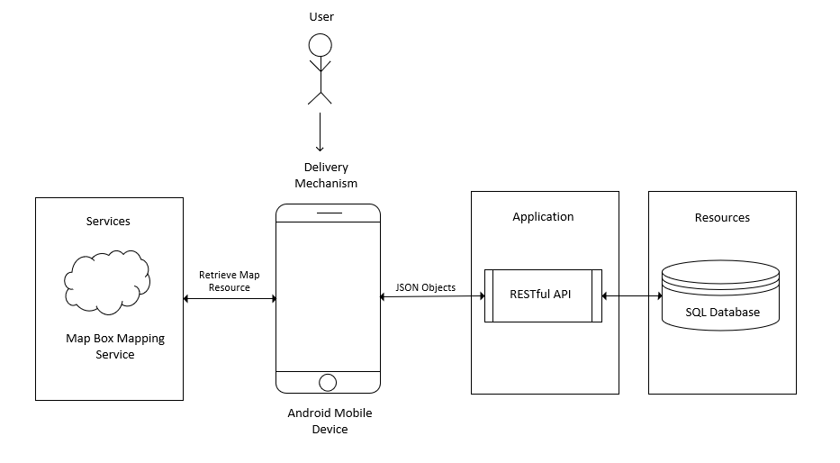
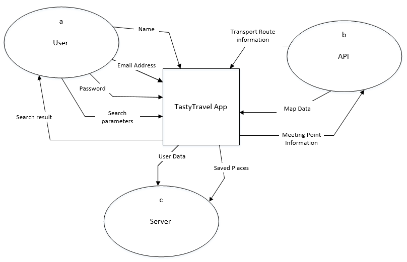
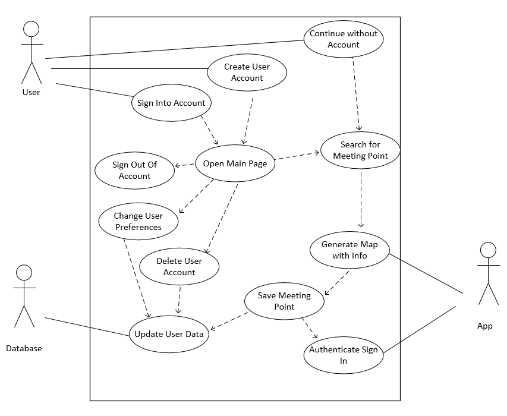
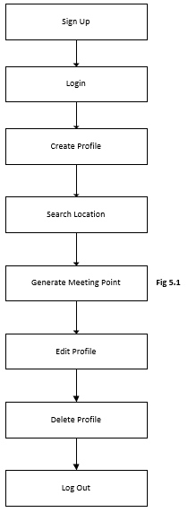
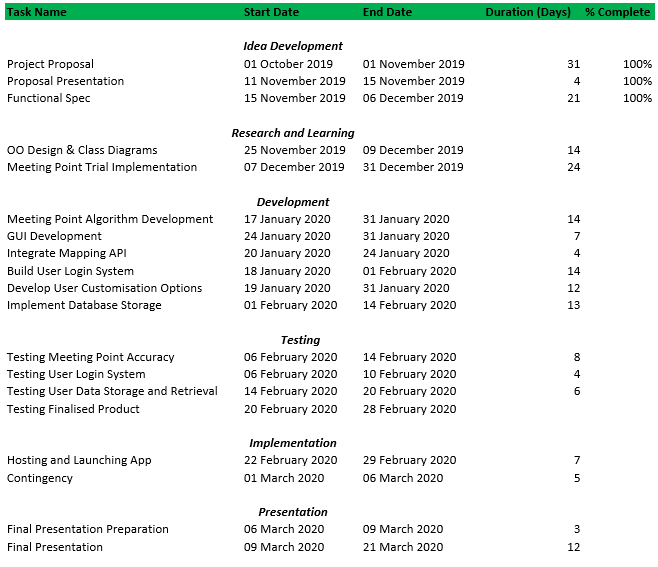
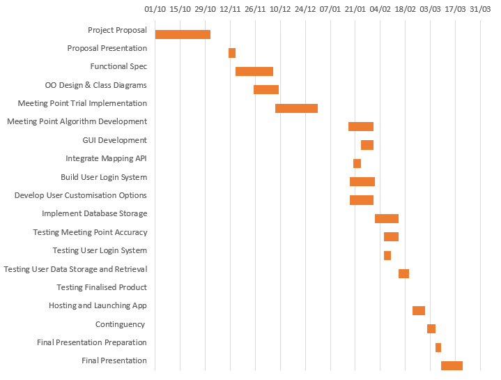

### Section 1: Introduction
------
1.1 Overview  
1.2 Business Context  
1.3 Glossary  
### Section 2: General Description
------
2.1 Product System Functions  
2.2 User Characteristics and Objectives  
2.3 Operational Scenarios  
2.4 Implementation Constraints  
### Section 3: Functional Requirements
------
3.1 Sign Up  
3.2 Create Profile  
3.3 Login  
3.4 Edit Profile  
3.5 Search Location Interface  
3.6 Generate Route  
3.7 Delete Profile  
### Section 4: System Architecture
------
4.1 System Architecture Diagram  
### Section 5: High-Level Design
------
5.1 Context Diagram  
5.2 Use Case Diagram  
5.3 Higher Level Design Diagram  
### Section 6: Preliminary Schedule
------
6.1 Task Table  
6.2 Gantt Chart  
### Section 7: Appendix
------
------

# Section 1: Introduction
------

##### _1.1 Overview_
The product we plan to develop fits in the category of Travel/Dining. We will be developing 
an Android app using Android Studio. The main functionality of our app is to 
help a user and a person they want to meet find a meeting location by journey time rather  
than physical travel distance. The locations will be customised around personal preference.

We plan to incorporate a margin of error of (travel time * 10%) for possible destination  
locations. For example, for a travel time of twenty minutes, locations X,Y,Z located in the  
range 18 and 22 minutes away will still be considered no matter what selected transport  
mode.

We plan to recommend a top three selection of available meeting points for each search.  
The routes will be ranked according to personal preference of food/drink and travel time. If  
the three returned locations are not to the users liking, they can see more search results  
returned by clicking an option ‘show more’.

The locations will be located within an overlap of a variable radius (of a circle), depending on  
the distance possible to travel within a given time and supplied mode of transport. In the  
backend of the app we will have an appropriate algorithm to compute this radius and  
overlap. When a meeting point is selected the user will be supplied with the option of starting  
the meeting process, or saving the route for later.

Transport details will be returned to the user when the start option is selected. Information  
returned will include:
the required public transport route and starting point.
or navigation details if walking.

##### _1.2 Business Context_
_Demographic_: Our app will be suitable for a wide range of demographics, it will be  
suitable for people of all genders over the age of 13.

_Geographic Segment_: For this project we will be limiting our area of interest to Dublin  
only, this will help us fulfill the full functionality of the app and leave it easier to test.  

_Unique Selling Point_: We return a meeting point to the user based on travel time and  
not physical travel distance. This prevents unnecessary waiting for either party to  
arrive and the destination. 

_Business Opportunity_: Some similar but disadvantaged solutions available. It is likely  
that users will prefer our apps system of ranking based on travel time rather that  
physical travel distance.

_Advertisements_: There will be no monetary advertisements. The app will be shared  
with peers to use as they like.

##### _1.3 Glossary_  
---
| Acronym        | Defintion         |
| ------------- |:-------------:|
| API      | “Application Programming Interface” - an interface between different parts of the programme intended to simplify the implementation of software. |
| SQL     | “Structured Query Language”- a language used for relational database management and data manipulation. |
| SDK     | “Software Development Kit” - a set of software development tools for the creation of a software platform.  |
| TFI     | “Transport For Ireland” - Journey Planner and Real Time Transport Information for the island of Ireland.    |
| GUI     | “Graphical User Interface” - Allows users to interact with electronic devices through an interface. |

# Section 2: General Description
---

##### _2.1 Product System Functions_
Below is a preliminary list of the main functions for our android application. The list will be  
open to future additions if necessary.

- User Sign Up
- Create User Profile
- User Log In
- Set User Preferences
- Location and Mode of Transport Input
- Meeting Point Search
- Generate Meeting Point
- Save Meeting Point
- Delete User Profile
- User Log Out

##### _2.2 User Characteristics and Objectives_
The application will be accessible to anybody with access to an Android device and an  
Internet connection. The audience includes all genders over the age of 13. This is because  
Google requires all account users to be above this age. There will be no payment options in  
the app.

The app will be easily accessible with a user-friendly interface that the majority of users can  
successfully use. Ideally, the app would attract users who enjoy travelling to new places and  
experiencing new food & drink locations. The app will have a public transport option so it is  
optimal that the user will have a good level of independence.

Some desirable features that users would enjoy include :
- The ability to save some previous meeting points.
- If the user particularly enjoyed a meeting place from the past the app will allow them  
to save and revisit the location.

##### _2.3 Operational Scenarios_
We will focus on three user levels for our operational scenarios.  

1.  _Unregistered Users_:  

The unregistered user will have the application installed on their Android device, but will not  
yet have created a user account related to the app. This user has limited functionality of the  
application. Users without profiles can select the option, ‘Continue without user account’,  
on the sign up screen to access the main features of the app. These features focus around  
the search aspect where the user inputs user locations and selected mode of transport.  
Meeting locations are then returned to the user which they can choose from.  

The unregistered user will be restricted from operating the app in the following ways:  

- Saving a favourite meeting place.
- Seeing their meeting places recent history.
- Having personalised search results according to user data.  
 
This limited functionality should encourage the unregistered user to create a user account to  
gain the full functionality of the application.

2. _Registering Users_:

A new user will be presented with the option to ‘sign up with email’ at the starting screen.  
Here the user can enter a valid email address and a password if they want to create an  
account. The user’s password will be stored securely using encryption. The user will not  
have to verify their email address to continue using the apps services. When the user  
account has been successfully created they will automatically logged into the account and  
directed towards customising their account preferences including favourite food and drink.

3. _Registered Users_:  

Users with profiles will remain logged into the app after registering and customising their  
profile. Re-entering the app will bypass the starting screen and the main screen will be  
displayed. Users with accounts will have the full functionality of the app including customised  
search results according to their profile data. These users can search for meeting points and  
save those places if they liked the place. The registered user will also be able to view their  
previous location visit history.

##### _2.4 Implementation Constraints_

_Time Constraints_
- The project will need to be completed by March 2020. Project planning and time  
management will be a key concern for successful project completion. Unforeseen  
circumstances could cause project longevity. We plan to try and avoid any delays by  
setting realistic goals using a gantt chart and sticking to this rigid schedule.
 

_Group requirements_
- Being able to successfully work together to split up the work in the back-end and  
- front-end. Problems are when we can’t take advantage of the different services like  
- the TFI API and Mapbox API. 

_Financial Constraints_
- In order for the app to present a live map, there must be a cost-effective  
service. Billing services might cost too much, so we will select the mapping service that best  
meets our needs on both a financial and functionality level.  

_Efficiency of the Application_
- It is likely that our algorithm will grow in complexity and size. To avoid a large  
application install size we plan to implement a RESTful API which would allow our  
main algorithm to be accessed using API calls from the android application. A large  
application size would likely lead to stagnant performance on an older android  
device. Keeping the application small will allow our app to be installed on a broader  
range of devices.

# Section 3: Functional Requirements
---

##### _3.1 Sign Up_
_Description_
- This would be the first step the user takes to create a user account linked with  
the app to access full service functionality. 
- The user will be greeted with a main sign up page after launching the  
application on their device. 
- If they press on the button labeled “Sign Up” they will be transferred to the  
signup page. 
- To complete account sign up the user will be asked to enter their email  
address and enter a password. 

_Requisites_
- Completing this section will allow the user to get the full application  
functionality of saving previous meeting points and viewing their meet history. 
- Profile information such as name storage allows greeting personalisation and  
personal preferred food and drink allow for tailoring of returned search results.

_Technical Concerns_
- Ensuring the secure authentication of user details. 
- Securely storing sensitive user information ensuring user peace of mind.

_Dependencies_
- None.

##### _3.2 Create Profile_
_Description_
- After successfully registering by entering email and password, the profile  
customisation page will be displayed to the user.
- Here the user can enter their name which will be used to greet them on the  
- main app home screen, this is a required input.
- Other optional information includes prefered types of food and drink.

_Requisites_
- Profile information will allow for more precise and accurate search results  
being returned which matches the user needs better than general results.

_Technical Concerns_
- Secure storage of user information.

_Dependencies_
- Adding profile information depends on the user sign up function first, profile  
information must be linked to a specific account.
- This function can only be accessed after successful account creation.

##### _3.3 Login_
_Description_
- Located on the same page as the ‘sign up’ option. If the user has accessed  
the service before they will have the opportunity to sign in to their account  
they had previously created. 
- The user selects the ‘login’ option.
- When they have entered their email and password information they click the  
login button
- If the information matches the system records they will be logged into their  
account.

_Requisites_
- This will be a useful feature of the application, no account data will be  
exclusively stored locally.
- If the user switches devices their previously stored data will be pulled from the 
cloud database.

_Technical Concerns_
- Providing the user with a secure interface where they can enter information in 
a secure manner.
- For example obscuring their password entry.

_Dependencies_
- Being able to login requires the user to have already completed the sign up  
and profile creating phases.

##### _3.4 Edit Profile_
_Description_
- Here the user will be able to edit their existing stored profile information. 
- For Example: They will have to option of adding and removing preferred food  
and drink choices.

_Requisites_
- Critical for users who have changed tastes, want to change their email or  
update their password.

_Technical Concerns_
- SQL Queries must be used in an efficient and secure manner to update  
stored user information.

_Dependencies_
- This function requires the user to be registered and have completed the 
profile customisation step.

##### _3.5 Search Location Interface_
_Description_
- This interface allows a user to enter their location and the second parties location. 
- This search screen will be the main means of search used by the user to  
calculate a meeting point.

_Requisites_
- This is a pivotal function of the application.
- Using this function allows the user to view meeting points on a graphical 
mapping interface.

_Technical Concerns_
- Integrating the mapping service map into our application and being able to  
draw to the map, graphically displaying any meeting points and overlapping of  
locations.

_Dependencies_
- No dependencies.

##### _3.6 Generate Route_
_Description_
- The map displayed will show three routes for each individual towards the 
intended destination. 

_Requisites_
- The user must input valid locations.

_Technical Concerns_
- Routes could cause a lot of problems like duplicated results, wrong results 
and not enough results.

_Dependencies_
- No dependencies. Signing in is not required.

##### _3.7 Delete Profile_
_Description_
- Users who have created accounts must also be able to close such accounts. 
- All data pertaining to the user will be disposed of. This includes all personal  
information like email address and saved places.

_Requisites_
- User has an account in the database.
- 
_Technical concern_
- User data is not discarded properly causing privacy concerns.

_Dependencies_
- User must have logged in.

# Section 4: System Architecture
___

##### _4.1 System Architecture Diagram_

 
## Fig 4.1

Fig 4.1 above illustrates the architecture of the product. The diagram highlights the four main  
elements of our system architecture:

1. _Mapping API_: We’ve decided to use Mapbox mapping service. The app installed on  
the android device will use API calls to the mapping service to display mapping  
information on screen as well as computing travel times.

2. _Application installed on Android Device_: This is the front end of the system, what the  
user sees and interacts with to gain access to the other architectural elements of the  
product. This will be the least technical element of the product, as it is simply there so  
the customer can use the functions of the website in an aesthetically pleasing way. 

3. _RESTful Application API_
Uses HTTP requests such as POST, GET, PUT and DELETE.  
The RESTful API allows the application to communicate with the SQL database.  
It will take information inputted through the GUI in input forms and send this  
information to be stored in the database through SQL commands.

4. _SQL Database_: The Database relates directly to the application RESTful API. It will  
store the user information sent to it using SQL commands. User data will be read and  
written to the database. This user information will serve to enrich the user experience  
of the application.

# Section 5: High-Level Design
---

##### _5.1 Context Diagram_

 
## Fig 4.2

Fig 4.2 - The context diagram describes the relationship between the system and external  
entities through data. We can see that the TastyTravel app will receive the name, email  
address, password upon creating or logging in. 

The app will receive data from API and will return a search result to the user that includes a  
map and transport routes. Accounts and possibly routes will be sent to the server.

##### _5.2 Use Case Diagram_

 
## Fig 4.3

Fig 4.3 - The use case diagram specifies the expected behaviour and not the exact method of  
making it happen. In other words, it shows us the ‘what’ and hides the ‘how’.

We can see what a user will want to do when they open the app. Sign in, create an account,  
or skip the sign in page. We are not concerned with how they will create an account.

A use case diagram does not summarize relationship between actors and systems nor does  
it show the order in which steps are performed. It deals with the functional requirements.

##### _5.3 Higher Level Design Diagram_

 

_Step 1: Sign Up_
Register an email address and choose a password to give the ability to login to  
the application.

_Step 2: Login_
Login to the application using the email and address supplied in step one above.

_Step 3: Create Profile_
Input your name and enter your personal preferences for favourite food and drink  
when prompted. 

_Step 4: Search Location_
Using the application GUI enter the user location information and their friends  
location data.

_Step 5: Generate Meeting Point_
Once the user has entered both locations of the user and their friend, the  
application will return suitable meeting points.

_Step 6: Edit Profile_
If you want to update existing user data such as password or email address you  
can do so using the edit profile option.

_Step 7: Delete Profile_
If you would like to delete your user profile along with your user data you can  
choose the option of deleting profile.

_Step 8: Log Out_
Once you have finished exploring the various application features, you can then  
log out of your account.

# Section 6: Preliminary Schedule
---

##### _6.1 Task Table_
--- 
| Task Name | Start Date | End Date  | Duration (Days) |
| --------- |:----------:| ---------:|:----------------|
| Complete Project  | 01/10/2019 | 06/03/2020 | 157  |
|  | | | |
| **Deliverables**  |  |  |     |
| Project Proposal  | 11/10/2019 | 01/11/2019 | 21 |
| Functional Spec  | 25/11/2019 | 06/12/2019 | 11  |
|  | | | |
| **Implementation Research**  |  |  |     |
| Research and Learning  | 07/12/2019 | 17/01/2020 | 41 |
|  | | | |
| **Development**  |  |  |     |
| Back End Development | 18/01/2020 | 01/02/2020 |14 |
| UI Implementation | 01/02/2020 | 15/02/2020 | 14 |
| Code Integration | 15/02/2020 | 22/02/2020 | 7 |
| Code Testing | 22/02/2020 | 29/02/2020 | 7 |
| Technical Spec and User Manual | 29/02/2020 | 06/03/2020 | 6 |
| Project Submission  | 06/03/2020 | 06/03/2020 | 0 |
|  | | | |
| Project Demonstration | 09/03/2020 | 20/03/2020 | 11 |

##### _6.2 Gantt Chart_

   
## Fig 4.4

  
## Fig 4.5

# Section 7: Appendix
---

Android Developers. (2019). Documentation  |  Android Developers. [online] Available at: https://developer.android.com/docs/ [Accessed 3 Dec. 2019].

Flaskapi.org. (2019). Flask API. [online] Available at: http://www.flaskapi.org/ [Accessed 3 Dec. 2019].

Docs.oracle.com. (2019). Java Platform SE 7. [online] Available at: https://docs.oracle.com/javase/7/docs/api/ [Accessed 3 Dec. 2019].

Mapbox. (2019). Introduction. [online] Available at: https://docs.mapbox.com/api/ [Accessed 1 Dec. 2019].

Firebase. (2019). Documentation  |  Firebase. [online] Available at: https://firebase.google.com/docs [Accessed 5 Dec. 2019].