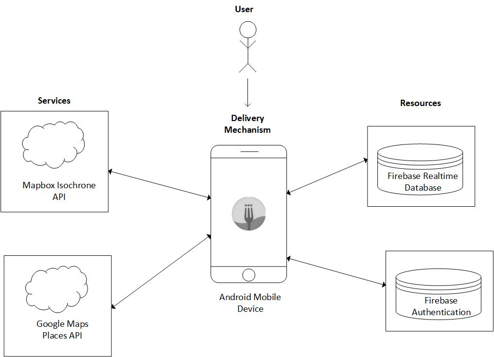
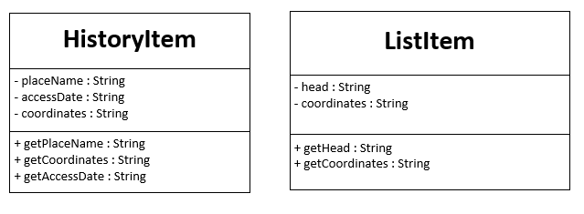
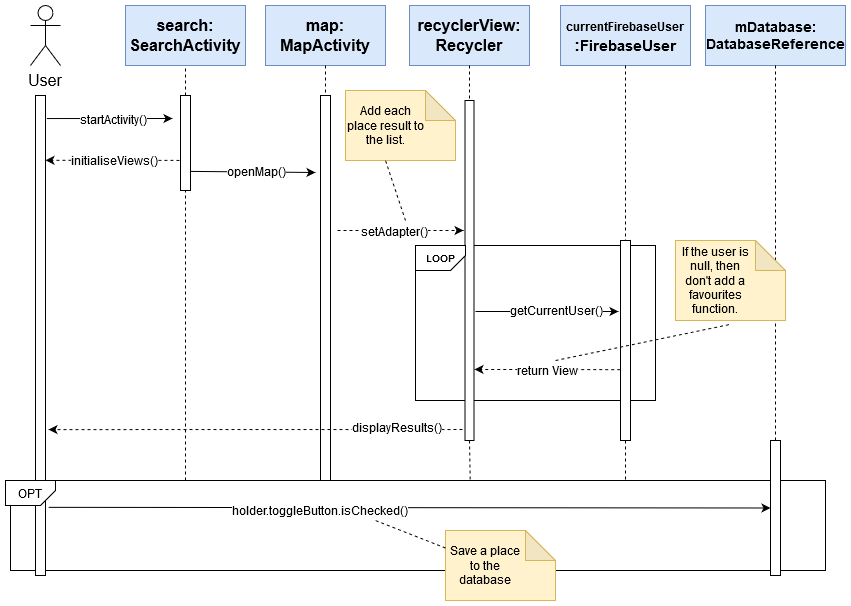
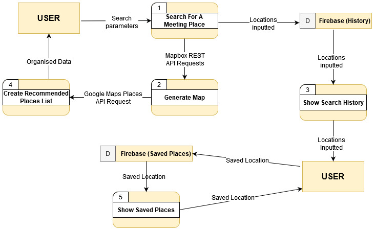
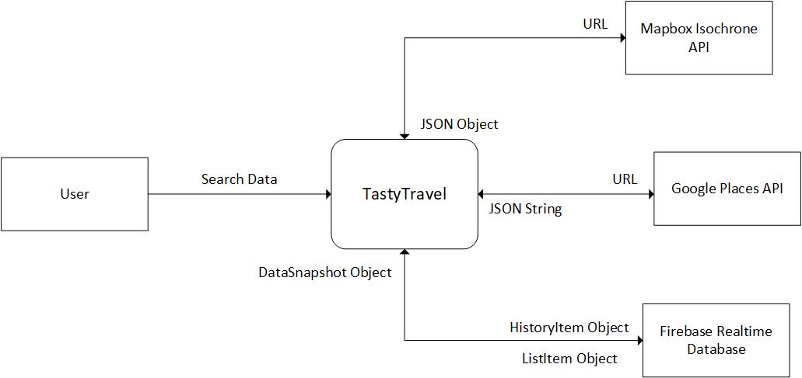
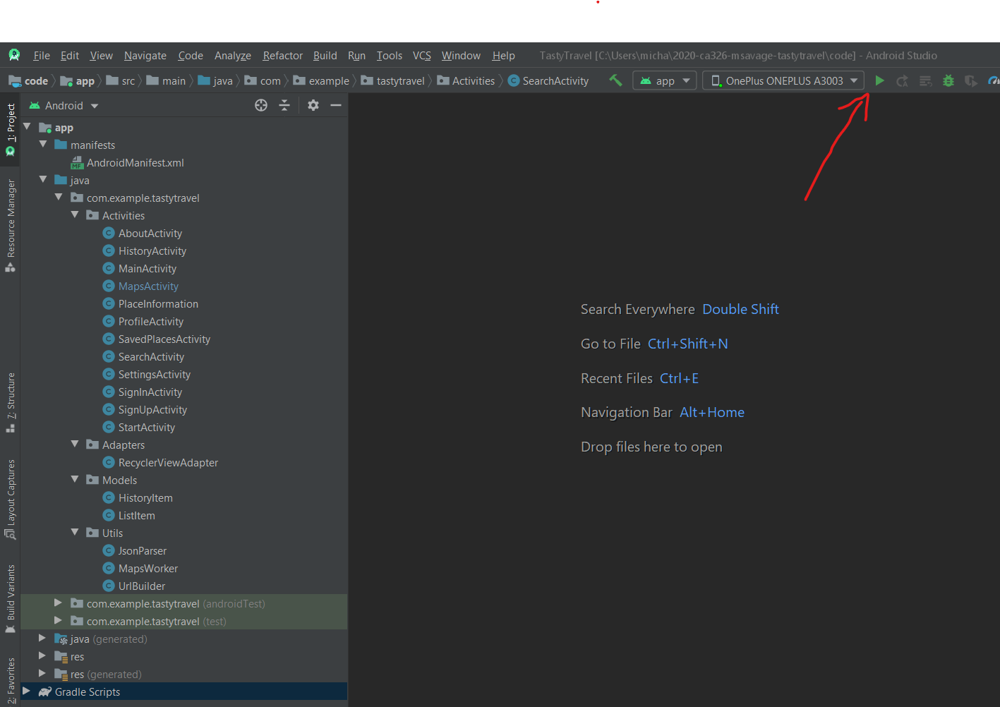

# TastyTravel Technical Manual

## Design Document Highlighting The Initial Design And Current Design.

### <em>Version 1 • March 2020</em>
  
  
  
  
**Michael Savage** - michaelsavage7@mail.dcu.ie  
•  
**Gerard Slowey** - gerard.slowey2@mail.dcu.ie  

  
  

---
# Table Of Contents 

1. [**Introduction** ](#introduction) 
&nbsp;&nbsp;&nbsp;&nbsp;&nbsp;&nbsp;1.1. [Overview](#overview) 
&nbsp;&nbsp;&nbsp;&nbsp;&nbsp;&nbsp;1.2. [Glossary](#glossary)  
2. [**System Architecture**](#architecture)  
3. [**High Level Design**](#high-level) 
&nbsp;&nbsp;&nbsp;&nbsp;&nbsp;&nbsp;3.1. [Object Models](#objects) 
&nbsp;&nbsp;&nbsp;&nbsp;&nbsp;&nbsp;3.2. [Class Diagram](#class-diagram) 
&nbsp;&nbsp;&nbsp;&nbsp;&nbsp;&nbsp;3.3. [Sequence Diagram](#sequence-diagram) 
&nbsp;&nbsp;&nbsp;&nbsp;&nbsp;&nbsp;3.4. [Data Flow Diagram](#data-flow-diagram) 
&nbsp;&nbsp;&nbsp;&nbsp;&nbsp;&nbsp;3.5. [Context Data Flow Diagrams](#context-diagram)  
4. [**Problems and Resolutions**](#problems-resolutions)  
5. [**Installation Guide**](#install)  

 

 

# 1. Introduction  

## 1.1. Overview 

TastyTravel is an Android app built with Android Studio 3.6.1.
The app allows one person to search for places for two parties to meet and the given results depend on their chosen mode of transport. 
The aim of the app is to return locations on an interactive Google Map that each party can arrive at roughly at the same time. 
They can choose to search for either Bars, Cafes, or Restaurants.

 
When users of the app successfully search using all the parameters, they can look through at a list of 20 places or less. 
If the user has created an account before searching, their searches will be stored in our Firebase real-time database. 
They can find and delete their search history in the app. We also let users save places that they like and they can find 
and delete their saved places in the app too.

The app finds recommended locations by using Mapbox isochrones and the SphericalUtil class from Google. When the user presses search, 
the app builds a URL that takes in the mode of transport (Walk, Car, or Bike) and requests the JSONObject from MapBox. 
The JSONObject contains information on the properties and geometry of the isochrone, but most importantly we parse the 
coordinates from the URL into a list and use our algorithm to find suitable meeting places. We do this by iterating through the coordinates
list of your location and finding the shortest distance to their location. Then we do the vice versa until we end up with two locations. We then
use interpolation to get a midpoint between those locations where the midpoint is a given score that is influenced by the modes of transport.
The score is a fraction between 0 and 1. The score favours people who walk, then cycle, and finally driving. If the modes of transport are the
same then the fraction will be neutral at 0.5.

By default, the app does not draw the isochrone onto the app but a toggle can be switched on. This switch will add a Google 
GeoJsonLayer to the map using the coordinates list. 
  
  

## 1.2. Glossary

|  **Term**     |   Definition  |
| ------------- |:-------------:|
| **Android Studio**    | 
Android Studio is the official integrated development environment for Google's Android operating system, built on JetBrains' IntelliJ IDEA software and designed specifically for Android development. We are using version 3.6.1.
|
| **API**               | 
_Application Programming Interface_ is an interface between different parts of the programme intended to simplify the implementation of software. 
|
| **Firebase**          | 
Firebase includes services like analytics, authentication, databases, configuration, file storage, and push messaging. We are using The Firebase Realtime Database. It is a cloud-hosted NoSQL database that lets you store and sync data between your users in real-time.
|
| **Interpolate**       | 
To insert (something of a different nature) into something else. In our case, we use interpolation to return coordinates which lies the given fraction of the way between two other coordinates.
 |
| **Isochrones**        | 
A number of lines on a map connecting coordinates relating to the same time or equal times.
|
| **Mapbox**            | 
An open source mapping platform for custom designed maps that contains many APIs and SDKs. Mapbox Studio is like Photoshop, for maps.
|
| **REST**              | 
_REpresentational State Transfer_ is an architectural style for providing standards between computer systems on the web. A client makes a request to the server in order to retrieve or modify data on the server. 
|
| **Volley**            | 
Volley is an HTTP library. We use it for fast concurrent network requests to Mapbox.

# 2. System Architecture

  
Our app uses _Mapbox_ APIs to get isochrone coordinates. 
_Mapbox_ is a REST API called via the Android Volley http handler library.

We use _Google’s Maps_ SDK to make REST API calls to add markers and line overlays to the map, and to change the user's view of a particular map area.
The user also uses Google Maps Places API to search for locations. We benefitted greatly from this because of the auto-suggest function.

We use _Firebase_ for account authentication and we store saved places and search history locations in _Firebase_’s real-time database. It uses a NoSQL database approach.

  
  

# 3. High Level Design

## 3.1. Object Models

## 3.2. Class Diagram
  
  

## 3.3. Sequence Diagram

  

In this Sequence Diagram, we show the interaction between objects whenever the user wants to save one of the results they received 
from searching. First the user will open the search page and straight away the activity will prepare the parameters for input.
When the user presses `SEARCH` it starts the openMap() function adding the markers and running the algorithm. When the results are 
returned into a list, they are put into Cards that the user can scroll through. The map calls the recyclerView and checks if the user
is signed in. If they are then, the card view is different as it includes a heart favourite button that gives the user the option to 
save locations.

Whenever all the cards are intialised they are displayed for the user and they can then favourite a place if they choose to.

  
  

## 3.4. Data Flow Diagram

  
  

## 3.5. Context Data Flow Diagrams

Items external to the system but vitally important.

  

  

# 4. Problems and Resolutions
**Selected Place Not Updated When User Selected a New Location**  
We realised that if a place was searched for and selected using the maps AutoCompleteFragment and 
the user changed their mind and searched for a new location the old location remained selected and saved to the ArrayList. 
To solve this problem, instead of immediately saving the place to the ArrayList of places we assigned the Place 
object to a temporary Place object yourSelectedLocation and theirSelectedLocation.
Only when the user was happy with their chosen search parameters when they hit the `SEARCH` button was the 
Place objects saved in the list and passed to the next activity.
This allowed the user to change the locations multiple times and only the final chosen place would be used.

**Search Results Save Icon in Recycler View Falsely Showing Checked Toggle Button**  
Due to the nature of the Android RecyclerView it doesn't save the scroll position of the items being displayed. 
If a toggle button was clicked on one of the cardviews being displayed in the recycler view this resulted in every 8th 
toggle button after that cardview showing as selected also, when in fact this was not the case.
To overcome this we used a SparseBooleanArray to keep track of the states of the toggle buttons attached to each card in the recyler view.
The SparseBooleanArray simply mapped the integer representing the position of the card in the recyler view to a boolean (true or false) 
indicating whether the toggle was checked or not.

**Search Result Would Return Empty List Because The First Index Wasn't Considered**

  
  

# 5. Installation Guide

### Foreword  
An active internet connection is required to use this application.

### APK Version:  
1.0

### Software and Hardware Requirements
This application is designed to run on the *Android* mobile operating system and is only compatible with 
devices running Android *version 5.0 (SDK version 21) or newer*.  
Since the application will be installed on the internal storage of the Android device, some free space will be required. Installation size is roughly around 6 MB.

### Installation Preconditions:
* An Android device will be required to install the TastyTravel application on. This device must have USB debugging enabled. 
* USB debugging is a setting available under the 'Developer Options' menu. If you are unfamililar with enabling developer options 
please read [this](https://www.howtogeek.com/129728/how-to-access-the-developer-options-menu-and-enable-usb-debugging-on-android-4.2/) article.

### Installation Instructions
1. To open the Android Studio code files and install the application on an Android device, a laptop or computer with Android Studio installed will be required.
The application source code can be accessed and downloaded from [here](https://gitlab.computing.dcu.ie/savagem7/2020-ca326-msavage-tastytravel).
2. Once you have a local copy of the source code import it into Android Studio.
3. Next, connect your Android device with USB debugging enable using a suitable USB cable.
4. When Android Studio has loaded the project files and detected the connected device, click the green triangle button making sure to 
select the correct device for application deployment. The application will now be installed on the connected device. 
More details can be found at this [link](https://developer.android.com/studio/run/device) if you are encountering difficulties.
5. A confirmation message should be displayed when Android Studio has installed the application onto the device successfully.
The application can now be used and it's functionality explored.

  
  