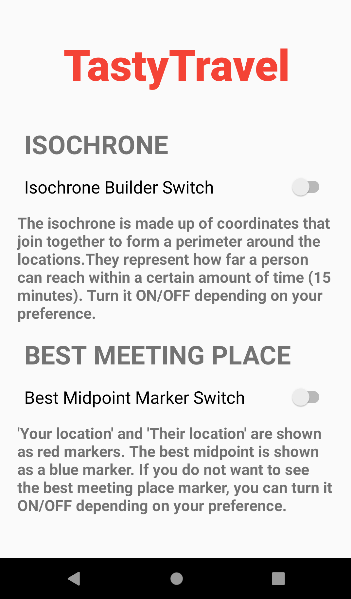
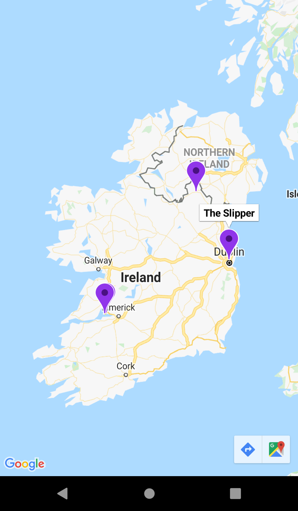
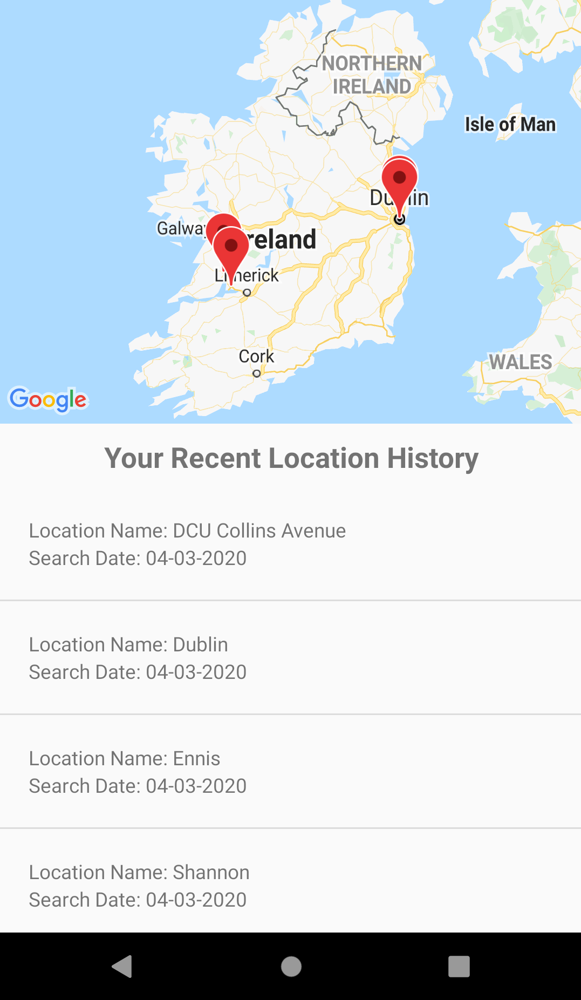

# TastyTravel User Manual

## How to use the TastyTravel Android app.

### <em>Version 1.2 • March 2020</em>
  
  
  
  
**Michael Savage** - michaelsavage7@mail.dcu.ie  
•  
**Gerard Slowey** - gerard.slowey2@mail.dcu.ie  
---

  
  

# Table Of Contents 

 1.
                    [Overview](#overview)  

 2.
                    [Creating An Account](#creating-an-account)  

 3.
                    [Signing In](#signing-in)  

 4.
                    [Navigation](#navigation)

 5.
                    [Searching For A Place To Meet](#search-page)  

 6.
                    [Understanding The Map](#map)  

 7.
                    [Styling The Map](#style)  

 8.
                    [My Saved Places](#saved)  

 9.
                    [My Search History](#history)

  
  
---

 

# Overview 
TastyTravel aims to allow the user to search for either restaurants, bars, or cafes that two people could meet at all over the world. The app works best for urban areas and cities where the availablity of these social places is higher. For this manual, we will pretend it is the user’s location and their friend’s location.  
In brief, the user successfully finds places to meet by doing the following steps;

### Step 1
The user inputs their location into the first text box with the hint `Enter your location`. 

### Step 2
The user will pick their chosen mode of transport. They can select either _Walk_, _Car_, or _Bike_.

### Step 3
The user will repeat steps 1 and 2 for their friend. The user will input their friend’s location into the second text box `Enter your friend’s location`.

### Step 4
The user will pick their friend’s chosen mode of transport.

### Step 5
The user will pick the type of meeting place from the dropdown menu. They can select either _Bar_, _Cafe_, or _Restaurant_.

### Step 6
When the user is happy with all the choices, they can press `SEARCH` to arrive at their unique map. The map will show the two locations inputted as red markers as well as a scrollable list of the recommended places that the two people can travel to. Press one of the names to show it's location as a purple marker on the map.

  
  
---

# Creating An Account 

On opening the app, you will be met with the start screen. Here, you can _sign in_, _sign up_, or _continue without an account_. Creating an account is easy and allows you to save places that you like when searching the map and it allows you to look at your previously searched locations.

  

  

Creating an account requires you to enter an email and password of your choice. The password must be at least 6 characters long and the email address must be valid like the following: **example@gmail.com**  
  

  

  

Pressing the `SIGN UP` button will successfully log you in and bring you to the _home page_.

---

# Signing In

You can sign back into the app if you have already created an account. Press the `SIGN IN` button on the _start page_ and enter the email and password you used.

  

  

  

If you do not have an account at the _sign in page_, you can create an account by pressing the `SIGN UP` button.

---

# Navigation

There are three main screens that the user can switch between using the bottom navigation bar.

1.  The _home page_ is the screen that you will first see after signing in. Here you can find the search function, your saved places, and your history of searches. Start the search function by pressing on the white search bar that says `FIND PLACES TO MEET`. You can look at your saved places by pressing on the image of coffee labelled `My Saved Places`. Refer to the section _Searching For A Place To Meet_ for more information.  
Similarly, you can view your history of searches by pressing on the image of beers labelled `My History`.

  

  

  

2.  The _about page_ will help you learn how to use the map and provides contact information for Michael and Gerard. We recommend reading this section before using the app's search function. The _about page_ will help you to understand the parameters and capablities of the app. Use your thumb to scroll down the page to read all the instructions.

  

  

  

3.  The _profile page_ includes five buttons. From top to bottom, there is a `CLEAR FAVOURITES` button that lets you delete your collection of saved places. Below that, there is a `CLEAR HISTORY` button that deletes your past searches. You can then find a `SETTINGS` button that brings you to two different toggles that can alter the map. Refer to the section _Styling The Map_ for more information.  
After this, there is a `LOGOUT` button and `DELETE ACCOUNT` button. Don't worry if you press them by mistake, a prompt will pop up asking are you sure.  

  

  

  

---

# Searching For A Place To Meet

When you open the _search page_ there will be five parameters that you must fill out. You can not progress to the map without filling them all in.
*  You must enter your location and the mode of transport you will take.
*  You must then enter your friend's location and mode of transport.
*  Finally, choose the type of place you want to meet from the dropdown menu. You have the option between either a Bar, Cafe, or Restaurant.

  

  

  

Start by pressing the first box with the text `Enter Your Location`. As you type, the search box will auto-suggest places for you.

  

  

  

When you have all the parameters entered, press the search button to see your map.

  

  

  

---

# Understanding The Map

The map will show you two red markers on the map that represent the locations you entered. You can press on the markers to see which is your location and their location.  

  

  

  

The results will show a list of places based on your parameters. It is a scrollable list that will give you maximum 20 meeting points. You can press on the names of the results to show it pop up on the map as a violet coloured marker. If you like one of the places, you can save it by pressing the red heart.

  

  

  

The map can be styled differently by returning to the _profile page_ and then going to the _settings page_.

---

# Styling The Map

There are two toggle buttons that can alter the appearance of the map. They are off by default.  

  

  

  

1. The first toggle button will draw an isochrone around the two inputted locations. An isochrone is a group of coordinates that are joined by black lines. They represent the area that you can travel to in 10 minutes depending on your mode of transport. 

2. The second toggle button will show you where the best meeting point is. It is a blue marker and the places returned to you when you search are ranked by their distance to this point.

---

# My Saved Places

You can find all your saved places by going to the _home page_ and pressing on the image of coffee labelled `My Saved Places`. The map stores all the points you ever saved as violet markers. You can press on any marker to see the place's name and you can get directions to a marker by pressing the pop up on the botom right of the map. This will bring you outside the app to Google Maps. If you want to delete your saved places go to the _profile page_ and press on `CLEAR FAVOURITES`.

  

  

  

---

# My Search History
You can locate your search history by returning to the _home page_ and pressing on the image of beers labelled `My History`. Here you can find the places you inputted into the search boxes at any time. The location name and date of entry are shown for your convenience. If you want to delete your search history go to the _profile page_ and press on `CLEAR HISTORY`.

  

  

  
