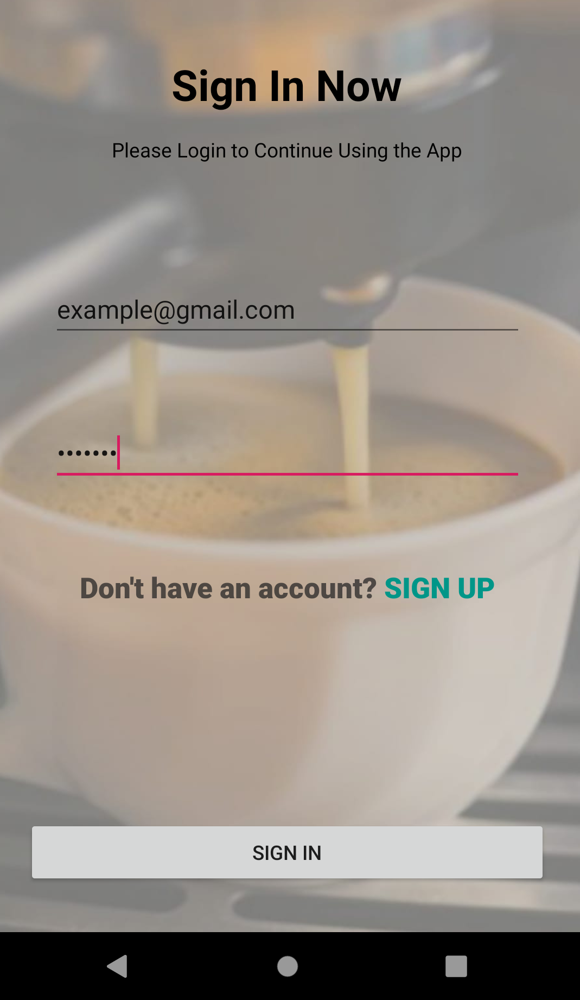
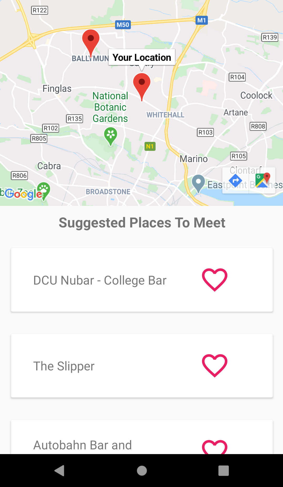

# TastyTravel User Manual

## How to use the TastyTravel Android app.

### <em>Version 1 • March 2020</em>
  
  
  
  
**Michael Savage** - michaelsavage7@mail.dcu.ie • **Gerard Slowey** - gerard.slowey2@mail.dcu.ie
---

# Table Of Contents

[The Aim Of Our App](#the-aim-of-our-app)                             
 1. 

[Creating An Account](#creating-an-account)                           
 2. 

[Signing In](#signing-in)                                             
 3. 

[Navigation](#navigation)                                             
 4. 

[Searching for Places](#searching-for-a-place-to-meet)                
 5. 

[Saving Places](#saving-places)                                       
 6. 

  
  
  
  
---

 

# The Aim Of Our App
TastyTravel aims to allow the user to search for either restaurants, bars, or cafes that two people could meet at. The app works best for urban areas. For this manual, we will pretend it is the user’s location and their friend’s location.  
The user successfully finds places to meet by doing the following steps;

### Step 1
The user inputs their location into the first text box with the hint ‘Enter your location’. 

### Step 2
The user will pick their chosen mode of transport. They can select either Walk, Car, or Bike.

### Step 3
The user will repeat steps 1 and 2 for their friend. The user will input their friend’s location into the second text box  
‘Enter your friend’s location’.

### Step 4
The user will pick their friend’s chosen mode of transport.

### Step 5
The user will pick the type of meeting place from the dropdown menu. They can select either Bar, Cafe, or Restaurant.

### Step 6
When the user is happy with all the choices, they can press ‘SEARCH’ to arrive at their unique map.  
The map will show the two locations inputted as well as the names of some Places Of Interest.

---

# Creating An Account

On opening the app, you will be met with the start screen. Here, you can sign in, sign up, or continue without an account.
Creating an account is easy and allows you to save places that you find when searching the map.  

  
Creating an account requires you to enter an email and password of your choice. The email address must be valid like the following:  
**example@gmail.com**
The password must be at least 6 characters long.

Pressing the ‘SIGN UP’ button will successfully log you in and bring you to the home page.

# Signing In

  
You can sign back into the app if you have already created an account. Press the SIGN IN button on the start page and  
enter the email and password you used.

If you do not have an account at the sign in page, you can create an account by pressing the SIGN UP button.

# Navigation

There are three main screens that the user can switch between using the bottom navigation bar.

1.  The home page is the screen that you will first see after signing in. Here you can find the search function and saved places.  
Start the search function by pressing on the white search bar that says FIND PLACES TO MEET.  
Refer to the guide with images below to learn how to search.  
Look at your saved places by pressing the text 'Saved Places' or the image underneath it.  

  

2.  The about page will help you learn how to use the map and provides contact information. We recommend reading it before searching to  
get a good understanding of the app.  
This page is scrollable. Follow the steps to get a successful result.  

  

3.  The profile page contains a clear saved places button, sign out button and delete account button.  
Don't worry if you press them by mistake, there will be a prompt asking are you sure.  
The profile page also links to our settings page. It will be explained later.  

  

# Searching For A Place To Meet

When you open the search page there will be five parameters that you must fill out. You can not progress to the map without filling them all in.
*  You must enter your location and the mode of transport you will take.
*  Then enter your friend's location and mode of transport.
*  Finally, choose the type of place you want to meet from the dropdown menu. You have the option between either a bar, cafe, or restaurant.

  

Start by pressing the first box with the text 'Enter Your Location'. As you type, the search box will auto-suggest places for you.

  

When you have all the parameters entered, press the search button to see your map.

  

# Understanding The Map

The map will show you two red markers on the map that represent the locations you entered. You can press on the markers to see which is your location and their location.  

  

The results will show a list of places based on your parameters. It is a scrollable list that will give you maximum 20 meeting points.
You can press on the names of the results to show it pop up as a violet coloured marker.  
If you like one of the places, you can save it by pressing the red heart.

  

